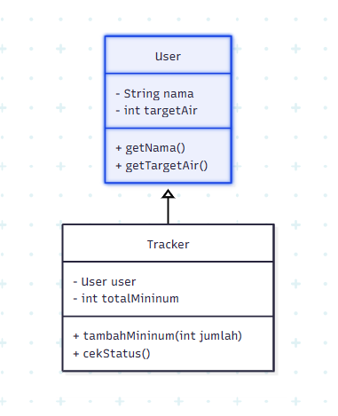
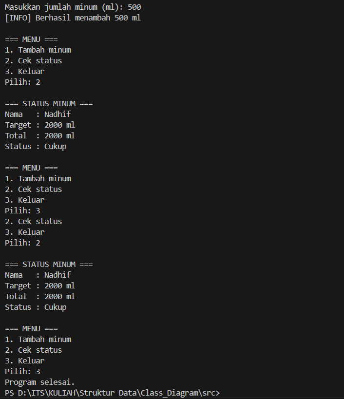

## Program pencatatan konsumsi air putih sehari-hari

### Deskripsi Kasus
Ada banyak orang yang sering lupa untuk minum air putih dalam memenuhi kebutuhan air sehari-hari. Dari program ini dapat membantu untuk mencatat konsumsi minum agar mencapat target yang dibutuhkan agar kebutuhan cairan tubuh terpenuhi untuk menjaga kesehatan. solusi dari permasaahan tersebut adalah membuat program yang bisa mencatat jumlah air yang diminum, membuat target harian, dan menampilakn status konsumsi air.

### Class Diagram

### Kode
```import java.util.Scanner;

class User {
    private String nama;
    private int targetAir;

    public User(String nama, int targetAir) {
        this.nama = nama;
        this.targetAir = targetAir;
    }

    public String getNama() {
        return nama;
    }

    public int getTargetAir() {
        return targetAir;
    }
}

class Tracker {
    private User user;
    private int totalMinum;

    public Tracker(User user) {
        this.user = user;
        this.totalMinum = 0;
    }

    public void tambahMinum(int jumlah) {
        totalMinum += jumlah;
        System.out.println("[INFO] Berhasil menambah " + jumlah + " ml");
    }

    public void cekStatus() {
        System.out.println("\n=== STATUS MINUM ===");
        System.out.println("Nama   : " + user.getNama());
        System.out.println("Target : " + user.getTargetAir() + " ml");
        System.out.println("Total  : " + totalMinum + " ml");

        if (totalMinum < user.getTargetAir()) {
            System.out.println("Status : Kurang minum");
        } else if (totalMinum == user.getTargetAir()) {
            System.out.println("Status : Cukup");
        } else {
            System.out.println("Status : Lebih");
        }
    }
}

public class Main {
    public static void main(String[] args) {
        Scanner input = new Scanner(System.in);

        System.out.print("Masukkan nama: ");
        String nama = input.nextLine();

        System.out.print("Masukkan target minum harian (ml): ");
        int target = input.nextInt();

        User user = new User(nama, target);
        Tracker tracker = new Tracker(user);

        int pilihan;

        do {
            System.out.println("\n=== MENU ===");
            System.out.println("1. Tambah minum");
            System.out.println("2. Cek status");
            System.out.println("3. Keluar");
            System.out.print("Pilih: ");
            pilihan = input.nextInt();

            switch (pilihan) {
                case 1:
                    System.out.print("Masukkan jumlah minum (ml): ");
                    int jumlah = input.nextInt();
                    tracker.tambahMinum(jumlah);
                    break;

                case 2:
                    tracker.cekStatus();
                    break;

                case 3:
                    System.out.println("Program selesai.");
                    break;

                default:
                    System.out.println("Pilihan tidak valid.");
            }

        } while (pilihan != 3);

        input.close();
    }
}
```


### ScreenShot Output 


### Penjelasan prinsip OOP
1. Encapsulation
menyembunyikan modifier dengan private seperti nama, targetAir, dan totalMinum. mengaksesnya menggunakan method getter.
2. Abstraction
class user dan tracker disembunyikan dari pengguna atau hanya sebagai mesin program.
4. Inheritence
Tracker menggunakan object dari class User

### Kesimpulan
Program ini menggunakan kasus sederhana yang dekat dengan kehidupan sehari-hari, yaitu pencatatan minum air. Program juga interaktif karena menerima input dari pengguna dan memberikan evaluasi status berdasarkan target yang ditentukan.

